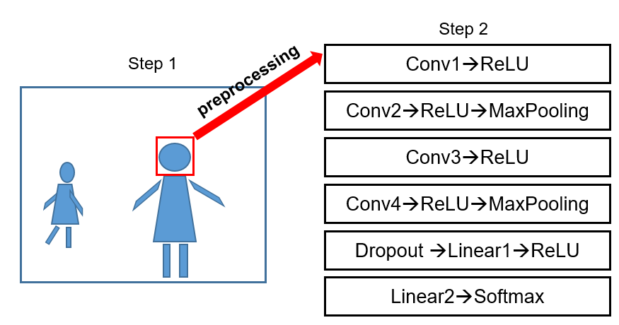
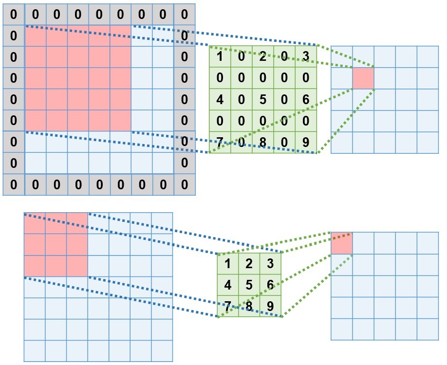
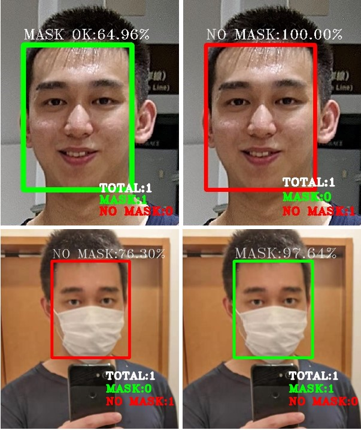
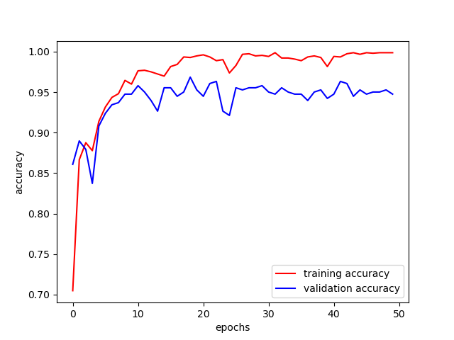
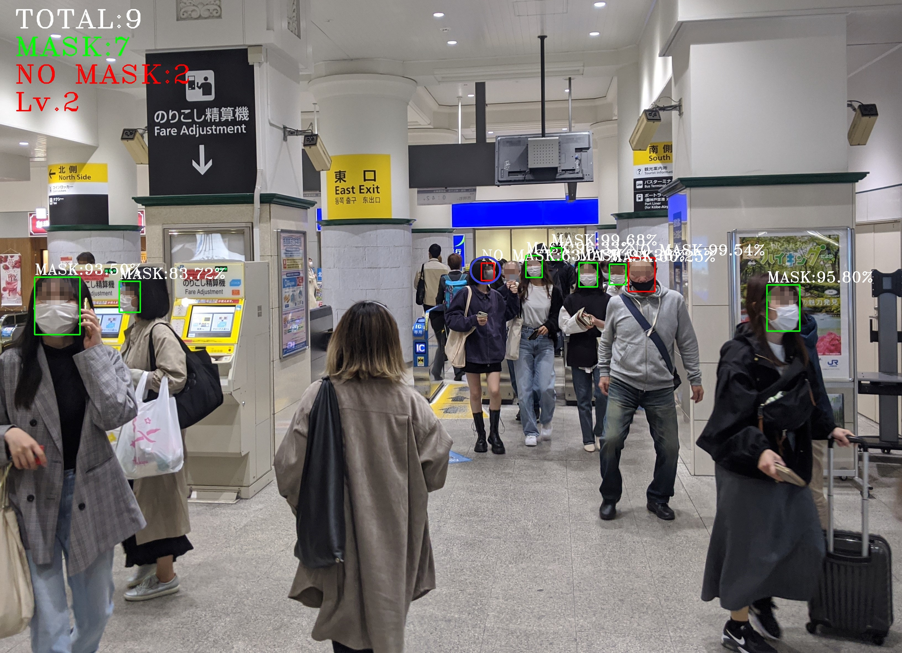

# COVID-19DangerousLevelPredictionBasedOnMaskCountingViaDNN
This paper [Detecting and Counting People without Mask with Deep Neural Network](https://www.jstage.jst.go.jp/article/jsp/25/6/25_251/_pdf) has been accpeted by Journal of Signal Processing.

### Citation
```
B. Zhang and M. Tanaka, "Detecting and Counting People without Mask with Deep Neural Network," Journal of Signal Processing, vol. 25, no. 6, pp. 251-255, 2021.
```

Based on the recent report on the risk standards of COVID-19 infection that appeared in 2019, it can be known that the thresholds of 20% and 50% of the number of people not wearing masks in a certain area can be divided into 3 levels of risk situations. 
```
level 1. safe 
level 2. a little dangerous
level 3. particularly dangerous 
```

In this work, we develop a real-time computer vision system to detect people and judge whether each person is wearing a mask or not. We construct a 2-stage algorithm based on deep convolutional neural networks, where the masks are treated as objects in an image. 




Furthermore, in order to improve the accuracy of recognizing masks when the human face occupies a large area of the image, we adopt the dilated convolution algorithm to solve this problem. 




We trained our model on the part of [RMFD dataset](https://github.com/X-zhangyang/Real-World-Masked-Face-Dataset), consisting of 1521, 381 and 212 images for training, validation and testing, respectively. And their accuracies were 99.7%, 94.5% and 94.8%.




# Usage
### Dependencies 
```
python=3.6
tensorflow (CPU)
tensorflow-gpu (GPU)
keras
opencv-python
matplotlib
scikit-learn
paddlepaddle==2.0.0rc0 (CPU)
paddlepaddle-gpu (GPU)
paddlehub
```

### Train, validation and test
```
training_CNN.py
```

### Demo 
```
detect_mask_PyramidBox.py
```


# Visualization of results
